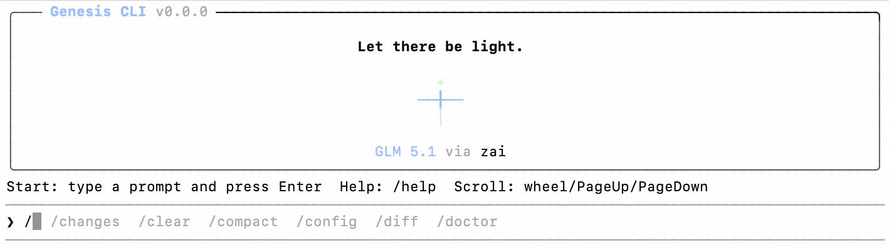

<p align="center">
  
</p>

# Genesis CLI

**An open-source coding CLI for engineering practice: organized around a layered `TTY / runtime / vendored kernel` architecture, with an ongoing focus on clearer module boundaries and long-term maintainability.**

[查看中文 README](README.md)

---

## Quick Start

### 1. Configure First

- User settings file:
  - macOS / Linux: `~/.genesis-cli/settings.json`
  - Windows: `%USERPROFILE%/.genesis-cli/settings.json`
- When `genesis` starts and this file does not exist yet, it creates the directory and a starter template automatically; if the file already exists, it is left untouched

Minimal example:

```json
{
  "env": {
    "GENESIS_API_KEY": "your_zhipu_api_key",
    "GENESIS_BOOTSTRAP_BASE_URL": "https://open.bigmodel.cn/api/coding/paas/v4/",
    "GENESIS_BOOTSTRAP_API": "openai-completions",
    "GENESIS_MODEL_PROVIDER": "zai",
    "GENESIS_MODEL_ID": "glm-5.1",
    "GENESIS_MODEL_DISPLAY_NAME": "GLM-5.1"
  }
}
```

Common fields:

- `GENESIS_API_KEY`: model API key
- `GENESIS_BOOTSTRAP_BASE_URL`: provider bootstrap base URL
- `GENESIS_BOOTSTRAP_API`: bootstrap transport, typically `openai-completions`
- `GENESIS_MODEL_PROVIDER` / `GENESIS_MODEL_ID`: default provider and model

Optional project-level overrides:

- `.genesis/settings.json`
- `.genesis/settings.local.json`
- `.genesis-local/pi-agent/models.json`

Current precedence:

- CLI flags
- shell environment variables
- `env` from `~/.genesis-cli/settings.json`
- project `.genesis/settings.local.json`
- project `.genesis/settings.json`
- local agent config under `--agent-dir`

### 2. Global Install

```bash
npm install -g @pickle-pee/genesis-cli@latest
genesis --version
```

### 3. Run

```bash
genesis
```

Expected result:

- `genesis --version` prints the installed CLI version
- `genesis` starts the interactive workbench
- when upgrading globally, `npm install -g @pickle-pee/genesis-cli@latest` and `genesis --version` should agree on the latest published version

On first launch:

- run `/help` and confirm slash commands are listed
- exit with `/exit` or `/quit`

Interaction basics:

- `↑` / `↓`: cycle local input history
- `Tab`: accept the first slash-command suggestion when available
- mouse wheel / touchpad: use native terminal scrollback for transcript history
- interactive mode stays on the primary terminal buffer, so the transcript remains visible after `/exit`
- `/exit`, `/quit`, or idle `Ctrl+C` closes the TUI and restores terminal state
- `Ctrl+C` aborts the active turn when a response is streaming
- `Ctrl+C` denies the current permission request when an approval menu is open

---

## Positioning

- one runtime powering `Interactive`, `Print`, `JSON`, and `RPC`
- Claude-like interactive TUI behavior on the primary terminal buffer
- explicit permission prompts and structured tool-step rendering
- OpenAI-compatible provider flow for live model integration
- a repository-owned vendored kernel and product runtime that can evolve together

---

## Top-Level Blueprint

Genesis deliberately aims for a "thin UI, rich contracts, repository-owned kernel" structure.

### Layers

- `packages/app-cli`
  - process entrypoint, TTY lifecycle, input loop, interactive mode host
- `packages/app-ui`
  - slash commands, pickers, formatters, interaction state, presentation rules
- `packages/app-runtime`
  - session facade, event normalization, tool governance, planning, product state aggregation
- `packages/kernel`
  - the vendored kernel
  - this should keep separating into a cleaner `session core` and `provider/tools`
- `pi-agent-core`
  - minimal agent loop, message-driven execution, tool-call primitives

### Design Rules

- `app-cli` owns terminal hosting, not product semantics
- `app-ui` owns interaction and rendering, not transcript persistence details
- `app-runtime` maps kernel semantics into product semantics, but should not parse transcript files directly
- `kernel session core` owns transcript persistence, resume, compact, context rebuild, and session metadata
- `kernel provider/tools` owns model auth, provider integration, and low-level tool wiring

### Placement Guide For Contributors

- TTY input, main buffer behavior, interactive lifecycle: start in `app-cli`
- slash commands, pickers, output formatting: start in `app-ui`
- session facade, event normalization, governance, planning: start in `app-runtime`
- transcript, resume, compact, recovery snapshot, session metadata: start in `kernel session core`
- provider integration, auth, tool wiring: start in `kernel provider/tools`

### Current Refactor Direction

The current priority is not adding more commands. It is continuing to straighten the `session core` boundary.

Already completed:

- `/resume` summary and restored-context preview
- a minimally working `/compact` flow
- `SessionRecoveryData.metadata` as a unified recovery contract
- moving session metadata out of `app-cli` private logic back into `kernel`

Still in progress:

- a truly stable `session-manager`
- a cleaner contract for `resume / compact / persistence / context rebuild`
- less cross-layer fallback logic and less duplicate parsing

---

## Development

### Local Work

```bash
git clone https://github.com/JianyangZhang/genesis-cli.git
cd genesis-cli
npm ci
npm run build
cp .env.example .env.local
npm run chat:live
```

- Node.js 20.0.0+
- a valid `GENESIS_API_KEY` in `.env.local`
- successful startup shows the `Genesis CLI` welcome card and the `❯ ` prompt

### Common Checks

```bash
npm test
npm run test:tui
npm run check:types
npm run check
npm run test:live:pi-mono
```

- `test:live:pi-mono` requires a valid API key in `.env.local`

### Release

```bash
npm run version:bump:patch
git add package-lock.json packages/*/package.json
git commit -m "release 0.0.2"
npm run publish:all
```

- release automation lives in `scripts/bump-version.mjs` and `scripts/publish-all.sh`
- `publish:check` includes a runtime-adapter smoke test from a temporary directory, so startup cannot silently depend on the monorepo root
- npm may still require browser confirmation when the account uses 2FA for writes
- after publish, verify the installed CLI with `npm install -g @pickle-pee/genesis-cli@latest` and `genesis --version`

### Other Entry Points

```bash
npm run chat:live -- --mode print
npm run publish:check
npm run publish:packages
npm run publish:verify
```

---

## More

- package-level docs: `packages/*/README.md`
- top-level source entry points: `packages/app-cli`, `packages/app-ui`, `packages/app-runtime`, `packages/kernel`
- primary verification commands: `npm test`, `npm run test:tui`, `npm run build`
